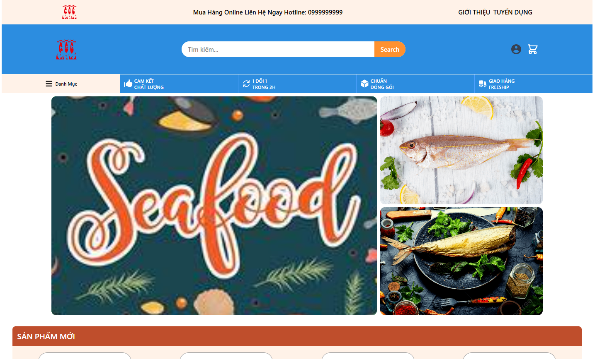
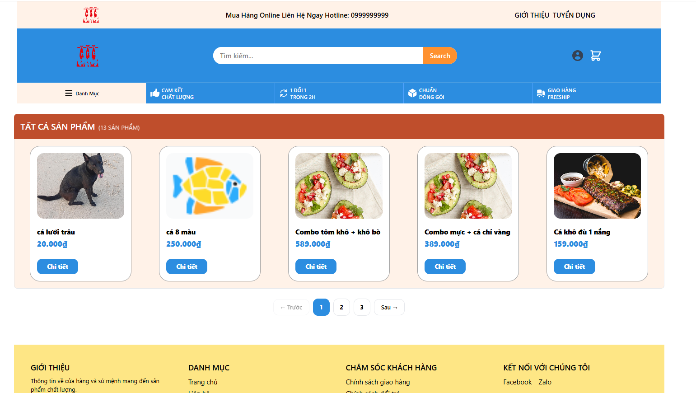

## Project
 - SeaFood — E-commerce Platform

## Live demo link
Frontend: https://seafood-liard.vercel.app/
Backend API: https://seafood-vyx2.onrender.com/

## Screenshots

## Features
- Browse 50+ dried seafood products by category
- Add to cart, manage quantities
- Checkout with JWT-authenticated orders
- Admin dashboard for order management

## Tech Stack
 - Frontend: React.js + TypeScript + Tailwind CSS + React Query + Zustand
 - Backend: Node.js + Express + MySQL
 - Auth: JWT

## Description
 - This project is a specialized e-commerce platform for seafood, allowing users to explore dried seafood products, 
order online, and track

## How to run locally
frontend :
cd frontend
npm install
npm run dev

backend:
cd backend
npm install
npm run dev

## API docs
GET https://seafood-vyx2.onrender.com/api/product/all toàn bộ sản phẩm
GET https://seafood-vyx2.onrender.com/api/product/:slug sản phẩm chi tiết

GET https://seafood-vyx2.onrender.com/api/category/all toàn bộ danh mục
GET https://seafood-vyx2.onrender.com/api/category/:slug danh mục chi tiết

POST https://seafood-vyx2.onrender.com/api/user/login đăng nhập
POST https://seafood-vyx2.onrender.com/api/user/register đăng kí

GET https://seafood-vyx2.onrender.com/api/order/all toàn bộ đơn hàng
GET https://seafood-vyx2.onrender.com/api/order/create tạo đơn hàng (cần token)
PATCH https://seafood-vyx2.onrender.com/api/orders/:id/status cập nhật đơn hàng

## Admin test account
liên hệ để cấp tài khoản admin để test